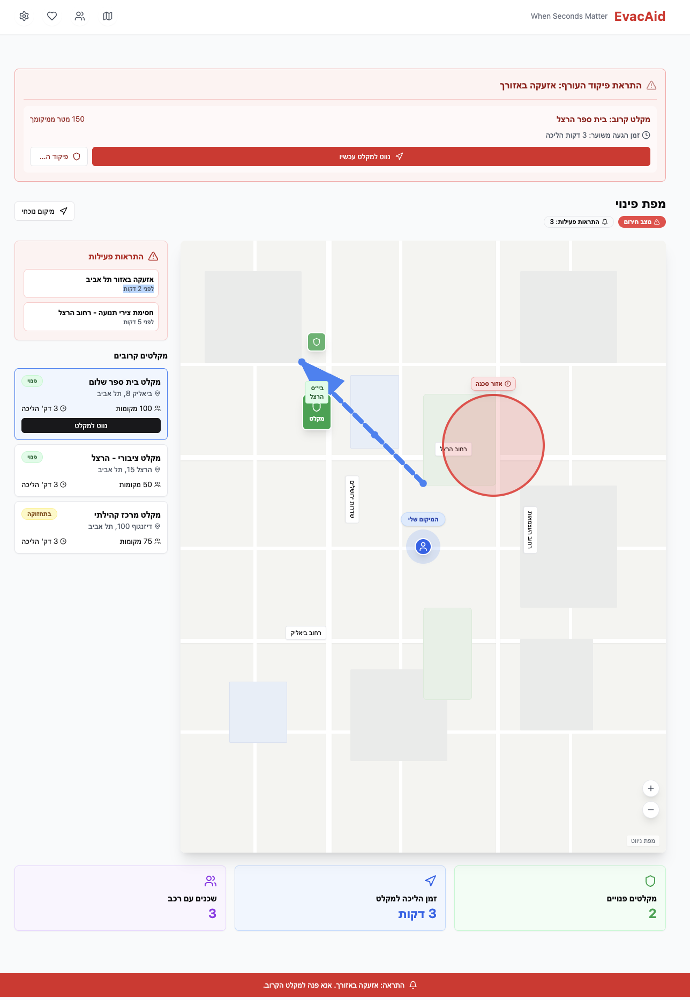
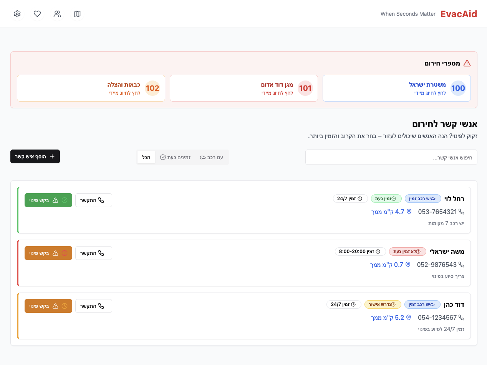
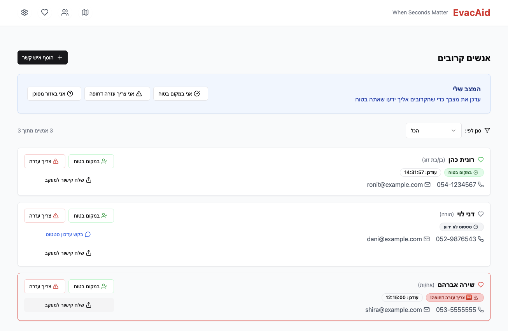
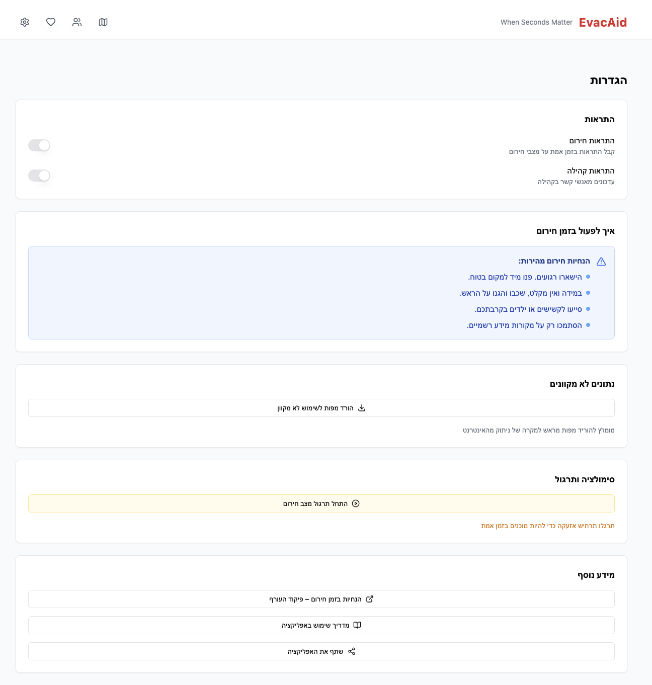
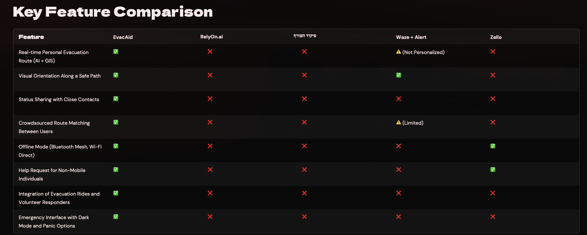

# Hackathon-AmazonxUniversity-Ariel

# EvacAid

## When Seconds Matter

EvacAid is a real-time emergency coordination platform designed to help civilians respond quickly and effectively during crisis situations.

This project was developed during the **Ariel University Hackathon**, held in collaboration with **Amazon**, focusing on startup solutions for **recovery, resilience, and emergency response**.

EvacAid helps civilians:

- locate the **nearest safe shelter**
- coordinate with **trusted people nearby**
- receive **clear emergency guidance**
- share **real-time safety status**

The platform combines **location intelligence, community support, and emergency navigation** into a single intuitive interface.

---

# Live Demo

Try the EvacAid prototype:

https://app.base44.com/apps/680e0a913bf6568230dcb0c9

---

# The Problem

During emergencies such as rocket attacks, natural disasters, or other crisis situations, civilians often face several critical challenges:

- locating the **nearest safe shelter**
- identifying **trusted people nearby who can help**
- coordinating actions quickly under stress
- receiving **clear situational awareness**

Most emergency systems provide alerts but lack tools for **real-time coordination and community support**.

This gap can lead to confusion, slower response times, and increased risk.

EvacAid addresses this challenge.

---

# The Solution

EvacAid integrates navigation, community coordination, and emergency guidance into a single platform.

With EvacAid users can:

- locate nearby shelters instantly
- navigate using the fastest evacuation route
- contact trusted people nearby
- share real-time safety status
- receive clear emergency instructions

The interface is designed to be **clear, fast, and usable under stressful situations**.

---

# Product Screens

## Real-Time Shelter Navigation

EvacAid provides an interactive map showing nearby shelters and the fastest route to reach them.

Capabilities include:

- real-time shelter detection
- fastest evacuation route calculation
- danger zone visualization
- estimated time to shelter
- list of nearby safe locations

This ensures users can **reach safety as quickly as possible**.

---

## Emergency Contact Network

Users can maintain a network of trusted contacts who may help during emergencies.

Features include:

- viewing nearby trusted contacts
- identifying contacts with vehicles
- initiating quick calls
- coordinating evacuation assistance

This enables a **community-based emergency support system**.

---

## Community Safety Status

EvacAid allows users to update and share their safety status.

Possible statuses include:

- Safe
- Need assistance
- In danger
- Unknown status

This allows communities to **quickly identify who needs help**.

---

## Emergency Guidance

The platform also includes structured guidance for emergency situations.

Users can access:

- safety instructions
- emergency behavior guidelines
- crisis response recommendations
- preparedness information

This ensures people can **make better decisions during high-pressure situations**.

---

# Example Scenario

1. A missile alert is triggered  
2. The user opens EvacAid  
3. The platform immediately displays:

   - the nearest shelter
   - the fastest evacuation route
   - nearby trusted contacts

4. The user can reach safety quickly or coordinate assistance.

The entire process takes **seconds instead of minutes**.

---

# Competitive Landscape

Existing tools such as navigation apps or messaging platforms provide **partial solutions**, but none offer a unified system designed specifically for **civilian emergency coordination**.

EvacAid combines:

- evacuation routing
- community coordination
- safety status sharing
- emergency guidance

into a **single integrated platform**.

---

# Market Opportunity

The global market for emergency response and public safety technologies is rapidly expanding.

**TAM – $150B**

Global market for emergency response, public safety technology, and smart evacuation systems.

**SAM – $7B**

Tech-ready high-risk regions such as:

- Israel
- Ukraine
- Japan
- Taiwan
- California
- South Korea

**SOM – $12M**

Initial deployment targets:

- Israeli municipalities
- Homefront Command
- educational institutions
- pilot international partners

---

# System Architecture

EvacAid is built with a simple and scalable architecture.

Frontend
- interactive UI
- map-based visualization
- responsive interface

Backend
- REST API
- entity-based data model
- contact and shelter management

Example Entity Structure

Contact

- name
- phone
- address
- has_car
- availability_status
- distance
- notes

---

# Future Development

Potential future directions include:

- integration with official emergency alert systems
- AI-based evacuation recommendations
- crowd-sourced hazard reporting
- mobile application deployment
- real-time crisis communication tools
- municipal emergency coordination dashboards

---

# Hackathon Project

EvacAid was developed during the **Ariel University Hackathon**, created in collaboration with **Amazon**.

The goal of the hackathon was to develop innovative startup solutions related to:

- emergency response
- community resilience
- crisis recovery technologies

EvacAid demonstrates how **technology and community coordination can significantly improve civilian safety during emergencies**.

---

# Vision

EvacAid aims to become a next-generation emergency coordination platform.

A system where:

- information flows instantly
- communities coordinate locally
- civilians receive actionable guidance in real time

Because in emergencies:

**every second matters.**

**EvacAid — When Seconds Matter**
